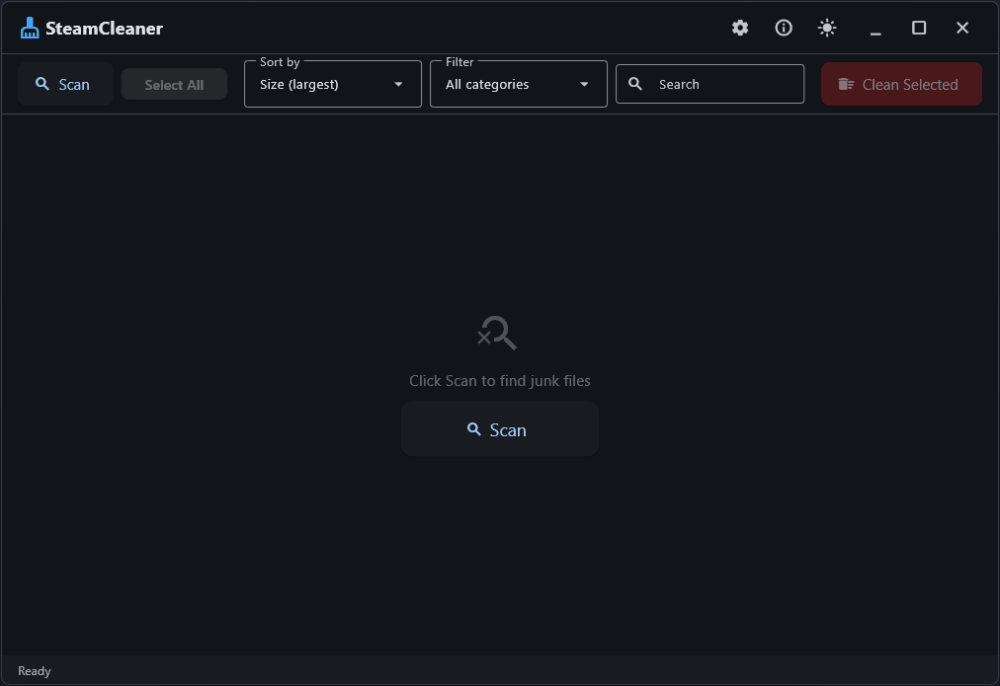

<h1 align="center">Steam Cleaner</h1>

<p align="center">
  <b>Reclaim disk space from Steam, Epic Games, EA App, GOG Galaxy, and Ubisoft Connect.</b><br>
  Spiritual successor to <a href="https://github.com/Codeusa/SteamCleaner">Codeusa/SteamCleaner</a> (archived, C#/.NET), rewritten from scratch in Python.
</p>

<p align="center">
  <a href="https://github.com/Solganis/SteamCleaner/releases"></a>
  <a href="https://github.com/Solganis/SteamCleaner/actions/workflows/ci.yml"></a>
  <a href="https://codecov.io/github/Solganis/SteamCleaner"></a>
  <a href="https://www.python.org/"></a>
  <a href="https://github.com/astral-sh/uv"></a>
  <a href="https://github.com/astral-sh/ruff"></a>
  <a href="https://github.com/astral-sh/ty"></a>
  <br>
  
</p>

<p align="center">
  
</p>

<p align="center">
  Games accumulate gigabytes of junk over time: redistributable installers, shader caches, crash dumps, old logs, unused cross-platform binaries.<br>
  Steam Cleaner finds them and lets you safely remove what you don't need.
</p>

---

## Quick start

Download the latest build from [Releases](https://github.com/Solganis/SteamCleaner/releases), run it, and press **Scan**.

To run from source:

```bash
uv sync
uv run steamcleaner
```

---

## Features

- **Cross-platform desktop app** (Windows, macOS, Linux) with automatic dark/light theme
- **Scans** Steam, Epic Games, EA App (Origin), GOG Galaxy, and Ubisoft Connect, including games installed through Wine, Proton, Bottles, Lutris, and other compatibility layers
- **Finds** redistributable installers, shader/web caches, crash dumps, old logs, bundled installers, and unused cross-platform binaries
- **Safe by default**: files go to system trash, symlinks and junctions are never followed
- **5 languages**: English, Russian, Chinese (Simplified), Spanish, Portuguese (Brazil)
- **Keyboard shortcuts** for scan, select, clean, and cancel

## What it finds

| Category | Examples |
|----------|----------|
| Redistributable installers | DirectX, Visual C++, .NET, PhysX, OpenAL in `_CommonRedist`, `redist`, `installer` |
| Shader/web cache | Steam shader cache, Epic/GOG webcache, EA Desktop cache, Ubisoft Connect cache |
| Crash dumps | `.dmp`, `.mdmp` files in game directories and launcher crash folders |
| Old logs | Log files over 1 MB in game directories and launcher logs |
| Cross-platform binaries | Ren'Py `lib/darwin-*`, `lib/linux-*` on Windows (and vice versa) |
| Bundled installers | Setup/installer executables inside game folders |

## Safety

- Known game files are never touched (e.g. `Steamworks Shared`, `Heroes of the Storm`, `Penumbra Overture`, `Medieval II Total War`)
- Symlinks and junction points are never followed or deleted through
- Files go to system trash by default, not permanent deletion
- Each detected item shows its exact path, category, and size before removal
