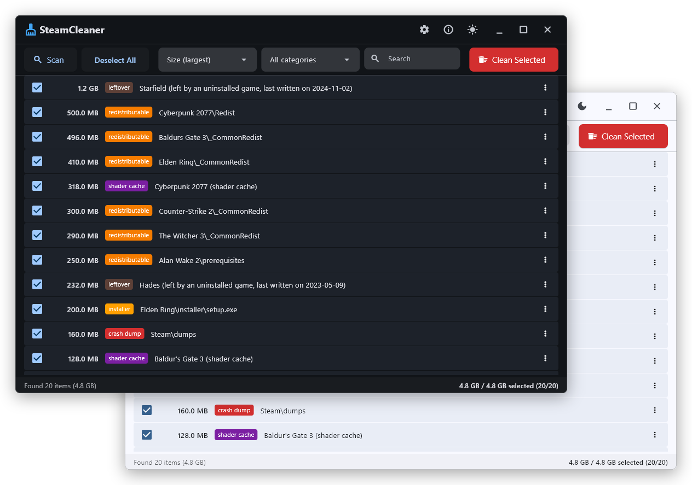

<h1 align="center">Steam Cleaner</h1>

  <b>Reclaim disk space from Steam, Epic Games, EA App, GOG Galaxy, and Ubisoft Connect</b> 
  Spiritual successor to <a href="https://github.com/Codeusa/SteamCleaner">Codeusa/SteamCleaner</a>

  

  
  
  
  
  
  
  
   
  
  

<h2 align="center">Quick start</h2>

  Download the latest build from <a href="https://github.com/Solganis/SteamCleaner/releases">Releases</a>, run it, and press <b>Scan</b> 
  Or run from source:

  <code>uv sync</code> &nbsp;then&nbsp; <code>uv run steamcleaner</code>

<h2 align="center">Features</h2>

- **Cross-platform** &middot; Desktop app for Windows, macOS, and Linux with automatic dark/light theme
- **Recoverable** &middot; **Files go to system trash by default, not permanent deletion**
- **Wine and Proton** &middot; Games installed through Wine, Proton, Bottles, Lutris, and other compatibility layers are scanned too
- **Game files** &middot; Known game files are never touched
- **Symlinks** &middot; Symlinks and junction points are never followed or deleted through
- **Leftovers** &middot; Folders of uninstalled games may hold saves, so the confirmation says in red how many of them are selected. Each is checked against Steam's manifests again right before it is deleted

<h3 align="center">What it finds</h3>

<table>
<tr><th>Category</th><th>Examples</th></tr>
<tr><td>Redistributable installers</td><td>DirectX, Visual C++, .NET, PhysX, OpenAL in <code>_CommonRedist</code>, <code>redist</code>, <code>installer</code></td></tr>
<tr><td>Shader/web cache</td><td>Steam shader cache, Epic/GOG webcache, EA Desktop cache, Ubisoft Connect cache</td></tr>
<tr><td>Crash dumps</td><td><code>.dmp</code>, <code>.mdmp</code> files in game directories and launcher crash folders</td></tr>
<tr><td>Old logs</td><td>Log files over 1 MB in game directories and launcher logs</td></tr>
<tr><td>Cross-platform binaries</td><td>Ren'Py <code>lib/darwin-*</code>, <code>lib/linux-*</code> on Windows (and vice versa)</td></tr>
<tr><td>Bundled installers</td><td>Setup/installer executables inside game folders</td></tr>
<tr><td>Leftovers of uninstalled games</td><td>Folders in a Steam library that no installed game owns, each shown with the date it was last written</td></tr>
</table>

<h3 align="center">Keyboard shortcuts</h3>

<table>
<tr><td><kbd>F5</kbd></td><td>Start / stop scan (<kbd>⌘R</kbd> on macOS)</td></tr>
<tr><td><kbd>Ctrl+A</kbd></td><td>Select / deselect all</td></tr>
<tr><td><kbd>Delete</kbd></td><td>Clean selected items (<kbd>⌘⌫</kbd> on macOS)</td></tr>
<tr><td><kbd>Esc</kbd></td><td>Cancel scan, deselect, or clear search</td></tr>
<tr><td><kbd>Ctrl+Q</kbd></td><td>Quit application</td></tr>
</table>

  On macOS, use <kbd>⌘</kbd> in place of <kbd>Ctrl</kbd>

---
